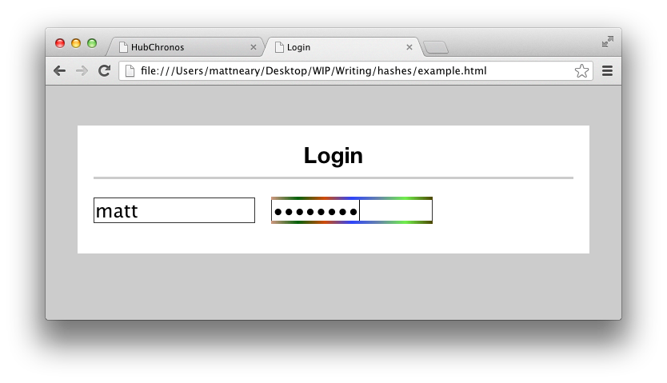

Hashword
========
Hashword serves to provide a user entering a password with instant feedback as to whether their entrance was correct. Additionally, a routine user can become familiar with the pattern they are used to seeing in order to avoid typos.

